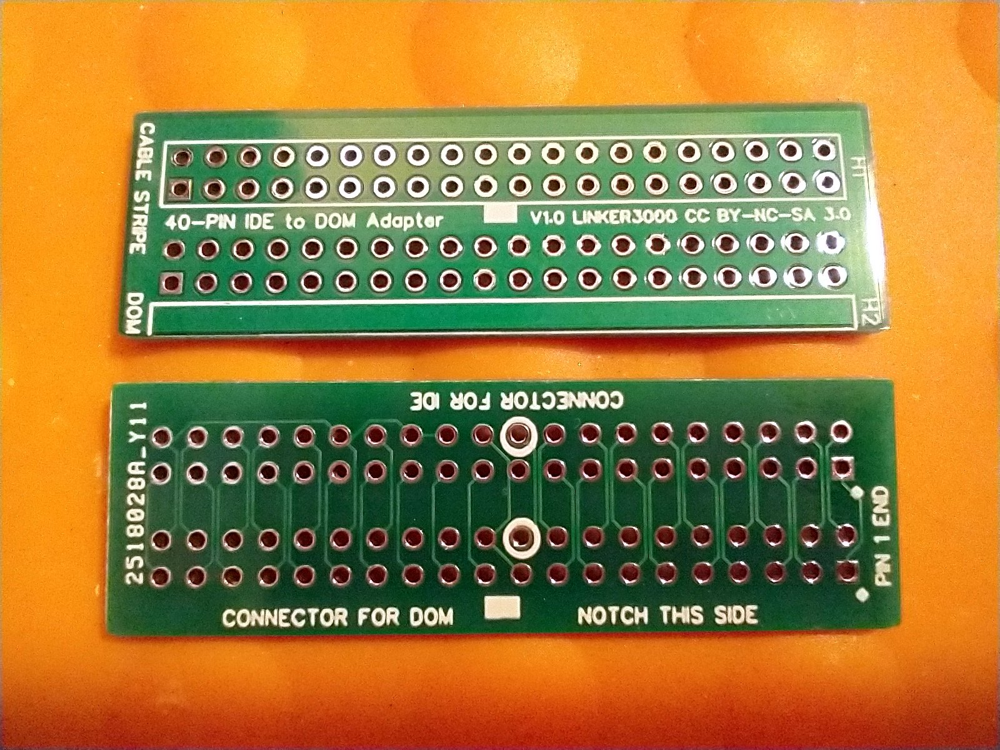
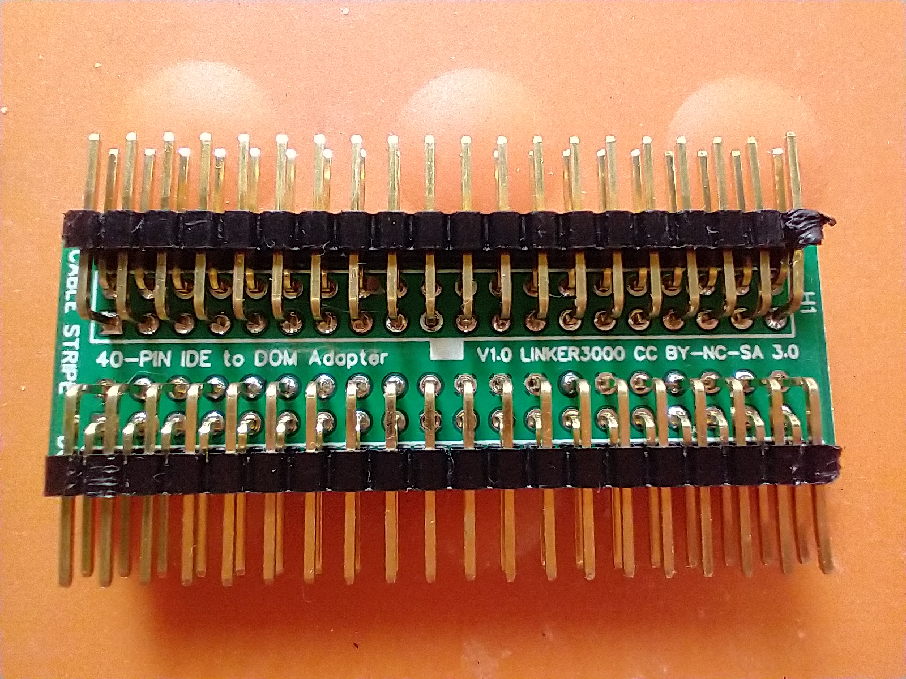
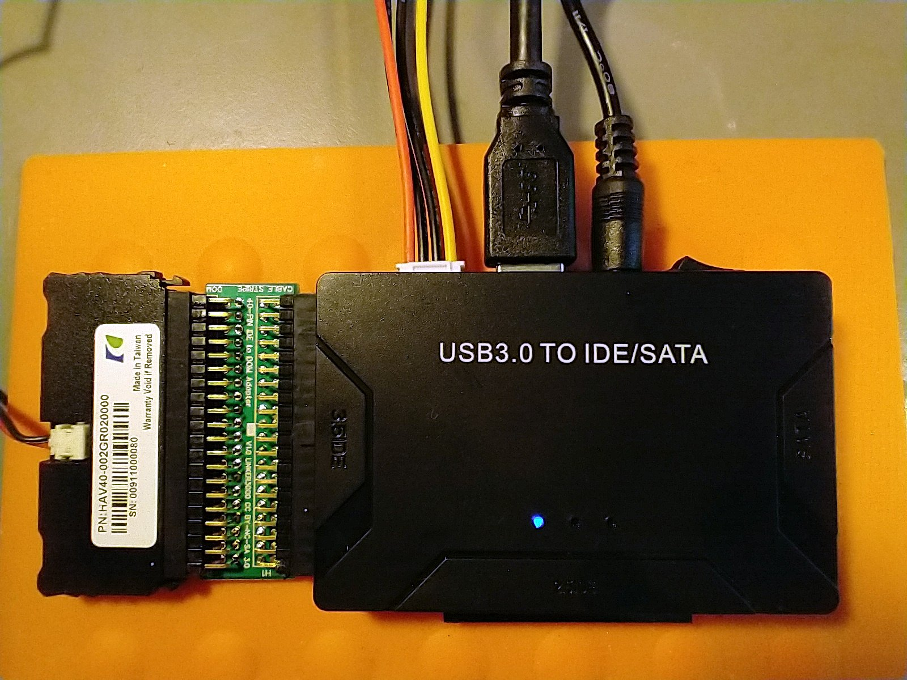

# DOM-IDE
A small board to allow a Disk On Module (DOM) to be connected to an IDE cable or Adapter.

**LICENCE: CC BY-SA-NC**

**This is a hobby project and comes with no official support. The PCB schematic and board design files are offered 'as is' with no claims made about their fitness for any specific purpose.**

If you don't know what a DOM is, and you don't use them, then this board is probably not of interest.

DOMs are designed to replace hard disks and are a precursor to the SSDs of today. The DOMs with IDE interfaces are designed to plug directly into the header on a computer motherboard, so if you want to attach one to a cable or use something such as a USB to IDE drive adapter to access a DOM then a 'crossover' adapter is needed; hence this PCB. You can find adapters for sale online, but it was cheaper (my time excluded) to lay out and order a batch from a PCB manufacturer based in the Far East. Plus is was a fun exercise.

If you fancy making your own adapter, you will need a PCB and some PCB header pins. Soldering is obvously required.

You'll find the design files here:

